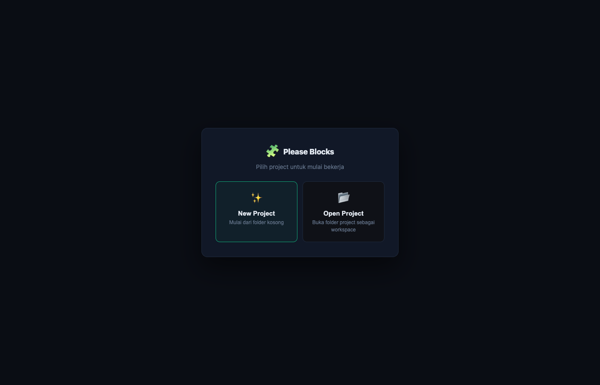
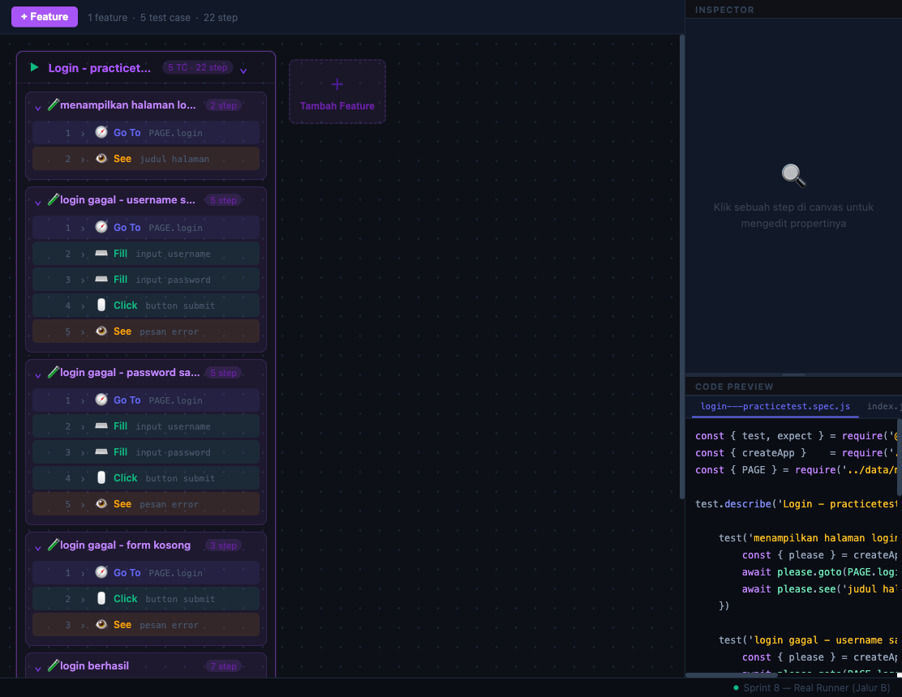
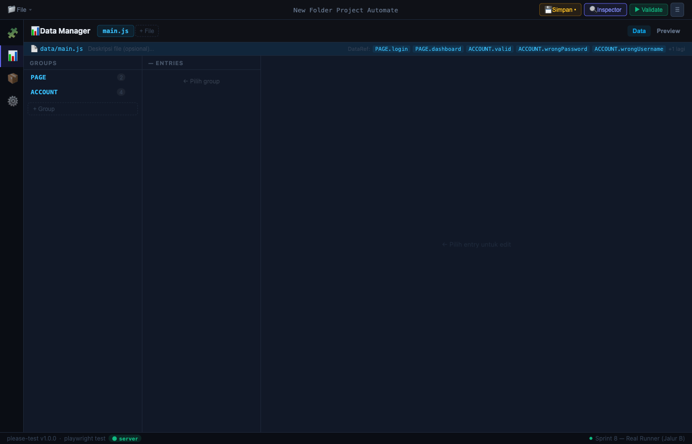
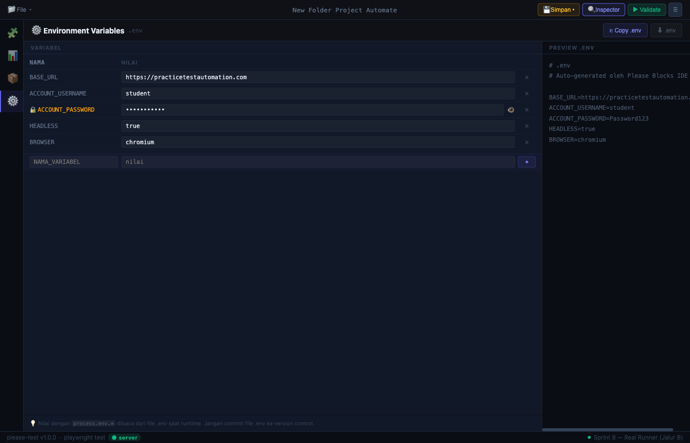
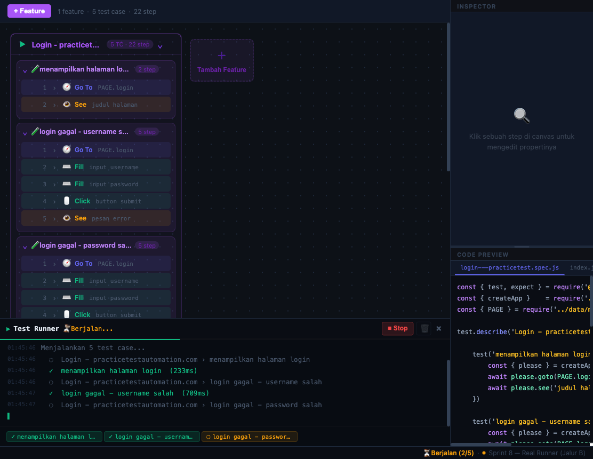

# Please Blocks

> Visual block-based IDE untuk QA Automation — tanpa menulis kode.

Please Blocks adalah drag-and-drop IDE di mana setiap langkah test direpresentasikan sebagai blok. QA menyusun blok di canvas → IDE menghasilkan JavaScript test script secara otomatis.

---

## Requirements

| Kebutuhan | Keterangan |
|---|---|
| Node.js ≥ 18 | Wajib |
| Browser | Chrome / Firefox / Edge |
| OS | macOS / Windows / Linux |

---

## Instalasi

```bash
npm install -g please-blocks
```

Jalankan:

```bash
please-blocks
```

Browser akan terbuka otomatis ke `http://localhost:3737`.

Untuk menghentikan:

```bash
# Ctrl+C di terminal, atau:
kill $(lsof -ti :3737)
```

---

## Screenshots

**Project Gate** — pilih atau buat project baru saat pertama kali dibuka.



**Canvas** — susun blok test secara visual, code preview ter-generate otomatis di kanan.



**Data Manager** — kelola URL, akun, dan data test terpusat.



**Environment Variables** — konfigurasi `.env` langsung dari IDE.



**Test Runner** — jalankan test dan lihat log real-time tanpa keluar dari IDE.



---

## Cara Pakai

### 1. Pilih atau buat project

Saat pertama kali dibuka, pilih **New Project** (folder kosong) atau **Open Project** (folder project yang sudah ada).

### 2. Isi data test

Buka **Data Manager** → tambahkan URL dan akun yang dipakai di test.

```js
// Contoh data yang di-generate
module.exports = {
  URL: {
    login: { url: 'https://app.com/login', title: 'Login' }
  },
  ACCOUNT: {
    valid: { username: 'user@mail.com', password: 'secret' }
  }
}
```

### 3. Susun blok di canvas

Drag blok dari palette ke canvas:

```
[Feature: Login]
  [Test Case: login berhasil]
    [Go To · URL.login]
    [Fill · "Username" · #username · ACCOUNT.valid.username]
    [Fill · "Password" · #password · ACCOUNT.valid.password]
    [Click · "Login Button" · button[type=submit]]
    [See Text · "Welcome" · .dashboard-header]
```

### 4. Simpan & jalankan

Klik **Simpan** → klik **▶ Run** → log test mengalir real-time di panel bawah.

---

## Blok yang Tersedia

| Kategori | Blok |
|---|---|
| Navigation | Go To, Verify Page |
| Actions | Click, Fill, Fill & Enter, Clear, Date Picker, Upload File, Scroll To |
| Assertions | See Text, Assert Equal, Assert Not Equal, Get Text, Get Value, Force Fail |
| Flow | Feature, Test Case |
| Utilities | Wait |
| Components | Blok dinamis dari `components/*.js` |

---

## Contoh Kode yang Di-generate

```js
const { please, AUTH } = require('../app')
const { URL, ACCOUNT } = require('../data/main')

describe('Login', () => {
  it('login berhasil', async () => {
    await please.goto(URL.login)
    await please.fill('Username', '#username', ACCOUNT.valid.username)
    await please.fill('Password', '#password', ACCOUNT.valid.password)
    await please.click('Login Button', 'button[type=submit]')
    const text = await please.getText('Header', '.dashboard-header')
    please.equal(text, 'Welcome')
  })
})
```

---

## Struktur Project yang Di-generate

```
[nama-project]/
├── app.js           # Setup Playwright + please instance
├── index.js         # Toggle fitur yang dijalankan
├── .env             # BASE_URL, credentials
├── components/      # Reusable action classes
├── data/
│   └── main.js      # Data test terpusat
└── feature/
    └── login.spec.js
```

---

## Tech Stack

Vue 3 · Pinia · Express · please-test · Playwright

---

**Author:** Ghany Abdillah Ersa  
**License:** MIT
